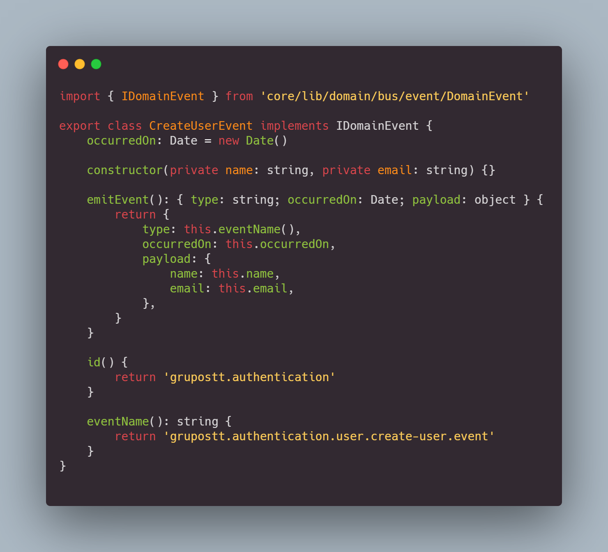

# Momenclatura Para Eventos De Dominio

A medida que estemos desarrollando aplicaciones con los estandares de calida
de software de grupo stt, se van a encontrar los eventos de dominio,
¿Que son los eventos de dominio?

> Un evento de dominio es una accion o un cambio que ocurre en un determinado contexto, en el cual debemos transmitir a los Dominio o Subdominio interesado en ese cambio

## Estructura Base

## id

Empezemos con el `id`. No se confunda, a pesar de que tiene un nombre muy comun, cabe resaltar que es el objeto que estamos creando es para un evento del dominio, por lo tanto es un id unico para cada evento (no es auto incremental o automatico, nosotros mismo debemos colocarle el nombre), la estructura para colocarle el nombre es simple, primero determinano la compañia o empresa en la cual estamos creando el evento, como son software para **Grupo Stt** entonces la primera llave sera **`grupostt`**, lo segundo que debemos determinar es el contexto en cual vamos a trabajar o estamos trabajando para el evento en este caso seria **`authentication`**, y eso seria todo, al final quedaria asi.

**Nota**: En este caso el `id`, seria el **exchange** del evento

## type

El siguiente es `type`, la propiedad type va hacer la encargada de el nombramiento del evento es decir, el nombre del evento, la cola, la routingKey, es muy importante ya que acabrca muchas cosas, para ahorrarnos tiempo, las primeras 2 claves del `type` es igual que la de `id`, asi que concatenamos la informacion del `id`, lo siguiente seria el modulo en el cual estamos trabajando, en este caso user, despues continuamos con la accion que estamos realizando, es decir el cambio que de estado de nuestro modulo, en este caso es crear un nuevo usuario, el acronimo puede quedar asi `create-user`, o se pueden guiar por el caso de uso, y por ultimo edentificamos si es un evento de dominio, ps se coloca `evento`, si solo necesitamos hacer un logger le colcamos `logger`, si un necesitamos un broadcast ya sabemos como quedaria `broadcast`, es cuestion de las necesitades

### Ejemplo

Lo primero que tenemos que tener el cuenta es el **contexto** en el cual vamos a trabajar, asi que lo determinamos en la estructura de directorio

Luego de eso sigue el modulo en el cual vamos a trabajar

Y aqui si es importante, ya que el caso de uso es donde publicamos el evento, asi que la nomenclatura tiene que ir de la mano con el caso de uso

Y listo es una manera muy sencilla y practica para asignar correcamento un nombre de dominio

## occurredOn

Bueno sin duda este es el mas facil, simplementa es la fecha y hora actual, en el que el evento fue lanzado

## payload

El **payload** es importante, ya que es la razon por la cual lanzamos un evento de dominio, para que los otros dominio y subdominio puedan actualizar en su base de datos un nuevo usuario, ya que la arquitectura de los microservicios no tenemos tablas relacionales, join, por lo no tenemos ese privilegio de que se actualice automaticamente por nosotros, pero la ventaja de no usar join ni relaciones, es la velocidad de insertar, y actualizar informacion en nuestra base de datos, por lo tanto para hacer esas actualizaciones que antes eran manuales, la hacemos con eventos, estan en tiempo real escuchando si se crea un usuario, si se actualiza y al momento de que emitan un evento, los dominio los capturan y enseguida actualiza o crea la informacion, asi que no debemos preocuparnos si nuestro informacion no esta a la mano

**Nota**: Asegurese de colocar los atributos necesarios en el payload, para que cada dominio capture el atributo que le interesa

## Ejemplo de codigo

Si queremos crear un evento si o si, debemos plasmar la informacion que queremos enviar en una clase, que tiene que implementar de **`IDomainEvent`** ya que la interface te obliga a colocar todo los atributos y metodos que requere un evento, en el constructor le tienes que mandar los atributos que necesitas enviar en el bus de evento

La clase **`CreateUserEvent`** se debe instanciar en el **AgregateRoot** de la entidad, tiene que tener coherencia en que metodo del agregate vas a instanciar un evento de crear un usuario.

Despues de instanciar el usuario con los ValueObject, el objeto user cuando se instancia, te permite llamar un metodo llamado **`record`**, que eso tiene como preparar un evento, es decir lo coloca en un pila en memoria, para que el caso de uso pueda hacer un publisher del evento preparado, el **`record`**, recibe por parametros el evento ya formateado asi que es muy importante implemetnar el **`IDomainEvent`** ya que solo acepta ese tipo especifico

Ahora ya en el caso de uso tenemos disponible el evento formateado, ya lo unico que queda es publicar el mensaje, el metodo **`pullDomainEvents()`**, devuelve un array, con el codigo formateado, pero como en este caso solo nos interesa el objeto en si, utilizamos el operador spread para quitar la referencia del array y nos quedamos el objeto

